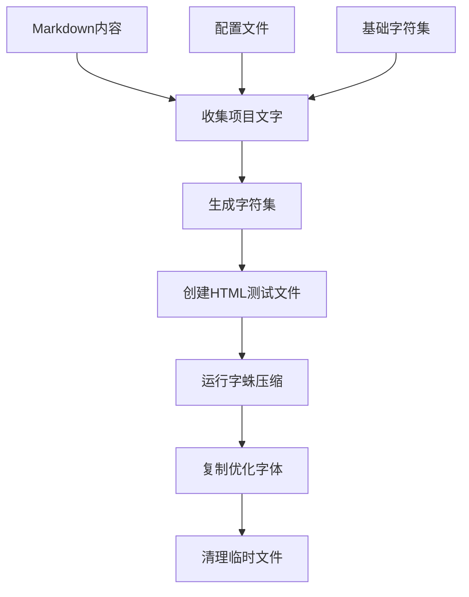

# 字体系统文档

## 📖 概述

本项目采用混合字体架构，通过 **Inter + Noto Sans SC** 的组合来实现最佳的中英文混排效果，同时利用字蛛(font-spider)技术对中文字体进行极致压缩。

## 🏗️ 架构设计

### 字体分工策略

```
┌─────────────────┬──────────────────┬─────────────────┐
│   字符类型      │   使用字体       │     用途        │
├─────────────────┼──────────────────┼─────────────────┤
│ ASCII字符       │ Inter            │ 英文、数字、符号 │
│ 空格 (U+0020)   │ Inter            │ 正常宽度空格    │
│ CJK字符         │ Noto Sans SC     │ 中文字符        │
│ CJK标点         │ Noto Sans SC     │ 中文标点符号    │
│ 代码字体        │ FiraCode         │ 等宽代码显示    │
└─────────────────┴──────────────────┴─────────────────┘
```

### 字体回退机制

```css
font-family: 'Inter', 'NotoSansSC', system-ui, sans-serif;
```

1. **优先匹配 Inter**：处理ASCII字符、空格、英文标点
2. **回退至 Noto Sans SC**：处理中文字符、中文标点
3. **系统回退**：确保兜底显示

## 📁 目录结构

```
src/assets/fonts/
├── inter/                    # Inter字体（2.4M）
│   ├── Inter-Regular.ttf     # 400
│   ├── Inter-Medium.ttf      # 500
│   ├── Inter-SemiBold.ttf    # 600
│   └── Inter-Bold.ttf        # 700
├── optimized/                # 优化后的字体（1.0M）
│   └── NotoSansSC/
│       ├── NotoSansSC-Regular.ttf    # ~235KB (原始10MB+)
│       ├── NotoSansSC-Medium.ttf     # ~235KB
│       ├── NotoSansSC-SemiBold.ttf   # ~235KB
│       └── NotoSansSC-Bold.ttf       # ~235KB
└── source/                   # 源字体文件（92M）
    ├── NotoSansSC/          # 原始思源黑体
    └── FiraCode/            # 原始代码字体
```

## ⚡ 字体优化

### 字蛛压缩流程



### 压缩效果

- **压缩前**：每个字重 10MB+
- **压缩后**：每个字重 ~235KB
- **压缩率**：97%+
- **包含字符**：~813个实际使用的字符

### 运行优化

```bash
# 重新优化字体
npm run font:optimize

# 完整构建（包含字体优化）
npm run build
```

## 🎯 解决的问题

### 1. CJK字体空格过宽问题

**问题描述**：在 Noto Sans SC 等CJK字体中，U+0020空格被设计为全字宽（1em），导致"City 的博客"中的空格显示过宽。

**解决方案**：

- Inter字体优先处理ASCII字符（包括空格）
- 空格使用Inter的正常宽度而非CJK的全字宽
- 通过字体回退机制实现字符分层处理

### 2. 字体文件过大问题

**问题描述**：完整的Noto Sans SC字体文件超过10MB，严重影响加载性能。

**解决方案**：

- 字蛛自动分析项目中实际使用的字符
- 只保留必要的字符，删除未使用的字形
- 97%+的压缩率，大幅减少字体文件大小

### 3. OG图像生成问题

**问题描述**：Satori生成OG图像时，中文字体中的空格显示异常。

**解决方案**：

- OG图像生成使用相同的字体回退机制
- Inter处理ASCII，Noto Sans SC处理CJK
- 确保网页和OG图像的一致性

## 🚀 使用指南

### Web字体加载

CSS中已配置完整的字体栈：

```css
/* 在 src/styles/global.css 中 */
@font-face {
  font-family: 'Inter';
  src: url('../assets/fonts/inter/Inter-Regular.ttf') format('truetype');
  font-weight: 400;
  font-display: swap;
}

@font-face {
  font-family: 'NotoSansSC';
  src: url('../assets/fonts/optimized/NotoSansSC/NotoSansSC-Regular.ttf') format('truetype');
  font-weight: 400;
  font-display: swap;
}
```

### Tailwind配置

```typescript
// tailwind.config.ts
fontFamily: {
  sans: ['Inter', 'NotoSansSC', ...fontFamily.sans],
  serif: ['FiraCode', ...fontFamily.serif]
}
```

### OG图像字体配置

```typescript
// src/pages/og-image/[...slug].[ext].ts
const ogOptions: SatoriOptions = {
  fonts: [
    // Inter字体优先处理ASCII字符
    { data: Buffer.from(InterRegular), name: 'Inter', weight: 400 },
    // Noto Sans SC作为CJK字符回退
    { data: Buffer.from(NotoSansSCRegular), name: 'Noto Sans SC', weight: 400 }
  ]
}

const fontFamily = "'Inter', 'Noto Sans SC', sans-serif"
```

## 🔧 维护指南

### 添加新内容时

1. 正常编写Markdown内容
2. 运行 `npm run font:optimize` 重新优化字体
3. 新字符会自动被包含在优化后的字体中

### 字体更新

1. 将新字体文件放入 `src/assets/fonts/source/`
2. 更新 `scripts/font-optimizer.js` 中的字体路径
3. 运行字体优化命令

### 性能监控

```bash
# 查看优化效果
du -sh src/assets/fonts/*/

# 查看字符统计
npm run font:optimize  # 查看控制台输出
```

## 🐛 故障排除

### 构建失败

1. **字体文件缺失**：确保 `src/assets/fonts/optimized/` 目录存在
2. **权限问题**：确保字蛛有读写临时目录的权限
3. **内存不足**：使用压缩字体而非源字体

### 字符显示异常

1. **新字符未显示**：运行 `npm run font:optimize` 重新优化
2. **空格显示过宽**：确认Inter字体正确加载
3. **字体回退失败**：检查CSS中的字体族配置

### OG图像问题

1. **Satori构建失败**：确保所有字体文件都使用Buffer.from()加载
2. **字符丢失**：确认字符已包含在优化后的字体中
3. **样式问题**：检查fontFamily配置

## 📊 性能指标

### 字体加载性能

- **Inter字体总大小**：2.4M (4个字重)
- **Noto Sans SC总大小**：~1.0M (4个字重)
- **总字体大小**：3.4M (对比原始95M+)
- **压缩比例**：96%+

### 构建性能

- **字体优化时间**：~15秒
- **总构建时间**：~20秒
- **热重载**：不重新优化字体，秒级构建

### 运行性能

- **首次加载**：优先加载Regular字重
- **字体回退**：无感知的字符分层显示
- **缓存策略**：浏览器缓存 + CDN缓存

## 🔄 持续优化

### 计划改进

1. **按需加载**：根据页面内容动态加载字重
2. **WOFF2格式**：进一步减少字体文件大小
3. **服务端优化**：预构建常用字符集合
4. **监控告警**：字体文件大小异常检测

### 最佳实践

1. **定期优化**：内容更新后及时运行字体优化
2. **监控指标**：关注字体文件大小和加载性能
3. **测试验证**：确保新内容的字符显示正常
4. **备份策略**：保留源字体文件用于重新优化

---

## 💡 技术细节

### 字蛛工作原理

1. **静态分析**：扫描HTML/CSS中使用的字符
2. **字形提取**：从原始字体中提取对应字形
3. **重新打包**：生成仅包含必要字符的新字体
4. **保持兼容**：维持原始字体的所有元数据

### Inter vs CJK字体空格差异

- **Inter空格宽度**：~0.25em (正常比例)
- **CJK空格宽度**：1em (与汉字等宽)
- **视觉效果**：Inter空格自然，CJK空格过宽
- **解决原理**：字体优先级 + Unicode分段匹配

---

_最后更新：2024年6月_
